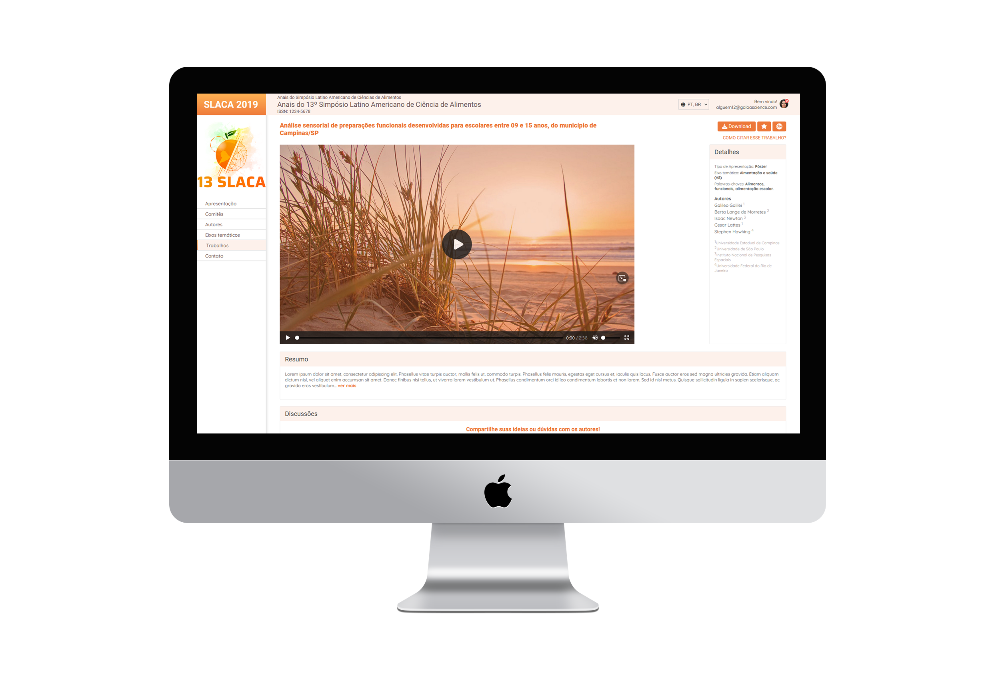

### :computer: Preview

### :iphone: Live Preview

- [Netlify](https://eloquent-youtiao-51cc73.netlify.app/)
- [Vercel](https://slaca-ten.vercel.app/)

Check the preview on any of the links above.

### :books: Technologies used

- HTML
- CSS
- JavaScript

### :rocket: Project

**Slaca** is a **website** made as a **challenge**.

### :desktop_computer: Layout

- [Figma](https://www.figma.com/file/0D27YdXU8ibf0AhsBC2OEm/Chuva---Exerc%C3%ADcio-Frontend)

### :computer: Development

Developed by **Tiago Martins Vargas**
